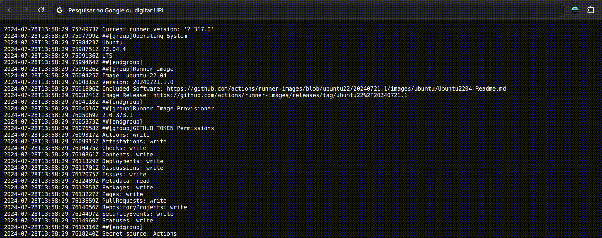

# page-text-replacer

This extension allows you to manipulate the text of web pages through a configuration, where you can specify rules via regex to capture and modify text on the page.

Rules are applied every 2 seconds



## How to install for use?

1. Open the [extension website](https://chromewebstore.google.com/detail/page-text-replacer/kjmpnhjiegmgajhgfhkgmppcoaofidcn?authuser=0&hl=pt-BR), install and pin it


## How to install for devs?

1. Extract the release you want to install


2.In Chrome, go to Manage extensions


3. Enable development mode and click load unpacked compression


4. Go inside the folder extracted in step 1 and select


5. The extension must be loaded


6. Pinned extension


7. Have fun clicking on the extension and opening the pop-up where you can paste the settings file, create configurations and even enable or disable extension processing


## How create a config?

The rules are defined through a list, which follows the following format:

```ts
[
  {
    
    name: '', // for organization
    url: '',  // for organization

    // regex that defines which sites the extension will be active on,
    // in this case, this rule will be active on the url that contains this pattern
    regexActiveOnUrl: 'github.*gabrielogregorio',

    // this is the query selector all that the extension should search for, this
    // is `document.querySelectorAll('query here')`, where the query here is the content below
    // 🚨🚨🚨 VERY IMPORTANT  🚨🚨🚨, if you have a nested html, example
    // <BaseTag>
    //   <LogTag class="text-black">
    //     yourLog
    //   </LogTag>
    // </BaseTag>
    // If you capture the BaseTag tag, the LogTag will be REMOVED in the process
    // of executing the regex, that is, the "text-black" class and the LogTag will be
    // REMOVED, this can BREAK the STYLING of the page. Analyze the
    // HTML and get the 'LogTag[class="text-black"]'
    // Suggestion for GCP logs in 2 ago 2024: logs-highlightable-text[class=\"logs-highlightable-text summary-text\"]
    querySelectorAllTextContent: '[itemprop="name codeRepository"]',

    // replacers are the replacement rules that the extension will use, we will see more in the topic below
    replacers: []
  }
];
```

## Replacers

Replacers are the rules that will be applied to the page, it follows the following format.

> Replacers change the `textContent` of each tag, that is, it is the equivalent of `document.getElementById('#exampleId').textContent`

```ts
{
  // In situations where `querySelectorAll TextContent` returns unwanted
  // content, you can use `regexSearchToApply` to filter only
  // the desired content
  // can be empty
  "regexSearchToApply": "log:",

  // only for organizations
  "name": "",

  // here is the regex that will be applied to the texts
  // It is equivalent to `new RegExp(regexGlobalFound, 'g')`
 "regexGlobalFound": ".*?msg:\\s(.*)",

  // here is the regex that will be applied to replace,
  // that is, it is the equivalent of
  // `htmlTag.textContent.replace(regex, replaceBy)`
  "replaceBy": "$1"
}
```

And of course, you can and it is preferable that you use the extension itself to generate your replaces, as shown in the image below:


You paste the target text, create your regex, your replace by and copy the generated settings, this will already return a regex escaped to JSON.

And finally, here is a complete example of the model

```ts
[
  {
    regexActiveOnUrl: 'github.*gabrielogregorio',
    name: '',
    url: '',
    querySelectorAllTextContent: '[itemprop="name codeRepository"]',
    replacers: [
      {
        regexSearchToApply: '',
        name: '',
        regexGlobalFound: '.*?msg:\\s(.*)',
        replaceBy: '$1'
      }
    ]
  }
];
```

Just paste your configuration


And enable the extension


## For devs

To contribute you can open issues, pull requests, I don't have many rules except that you cannot upload pull requests with .zip or any type of binary, all .zip will be generated only by min (JUST FOR SAFETY), but I fully accept ALL other changes to the code as long as you have eslint, prettier and commitlint configured (or that you follow the standard of these tools) and that all tests and ci are passing. 💛 💙